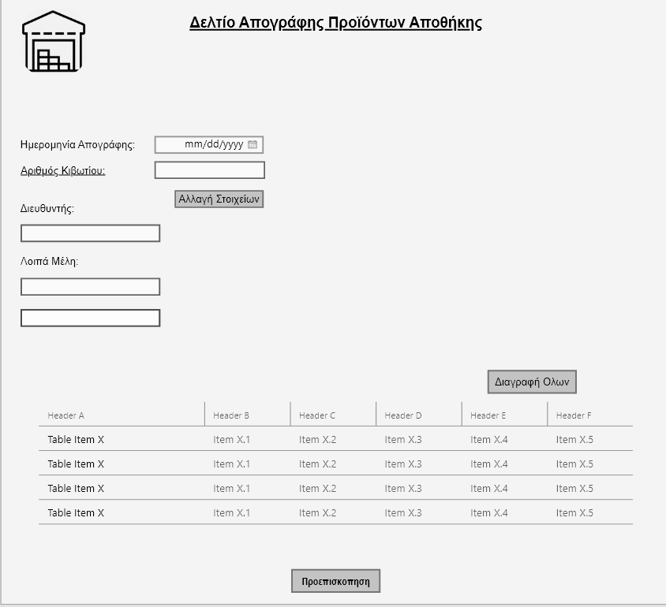
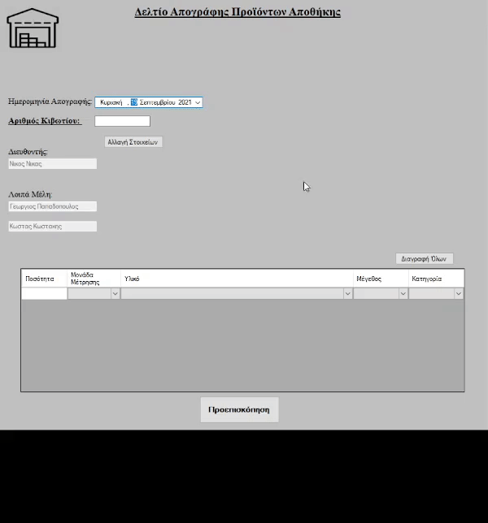

# WarehouseSolution

> Μια πρώτη εικόνα από την αρχική σελίδα του προγράμματος στο AdobeXD

---

###  Πίνακας Περιεχομένων

- [Περιγραφή](#περιγραφή)
- [Xαρακτηριστικά](#χαρακτηριστικά)
- [Τεχνολογίες](#τεχνολογίες)
- [Highlights](#Highlights)
---

## Περιγραφή

   
[Back To The Top](#warehousesolution)

---

## Xαρακτηριστικά
- Grid view με σύνδεση στην βάση δεδομενων για προσθήκη προιόντων
- PrintDocument/Printpreview για την δημιουργία εκτυπώσιμου αρχείου
- Δημιουργία αρχείου για την αποθήκευση κάποιων στοιχείων πχ ονόματα μελών

[Back To The Top](#warehousesolution)

---

## Τεχνολογίες

- C#
- ini parser(για την δημιουργια Settings)
- MS Access
- Visual Studio 2019

[Back To The Top](#warehousesolution)

---

## Highlights

> Γρήγορη ματιά στην εφαρμογή
 

 

[Back To The Top](#warehousesolution)